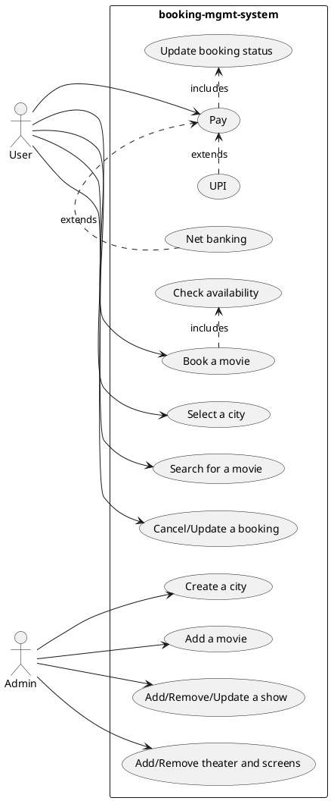
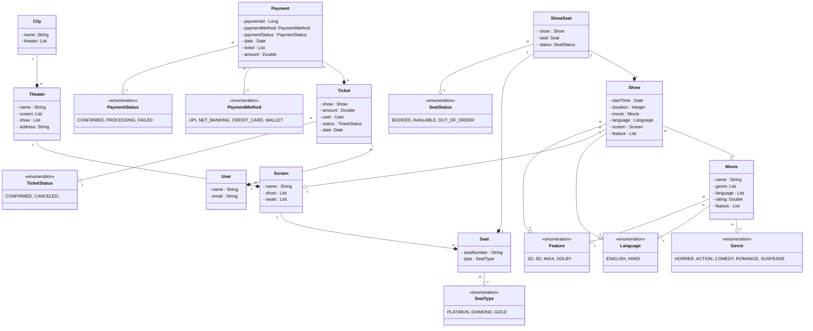

### Requirements gathering:
* Can we have multiple cities?
* Can we have multiple theaters?
* Can we have multiple shows?
* Can we have movie in multiple languages?
* Can user book multiple tickets?
* What are different payment mode?
* how user books a ticket?

Create a movie booking management system like BookMyShow to allow a user to search and book movie tickets.

### Requirements

Build an online movie ticket booking system that can support the following requirements:

* Support for multiple **cities**
* Each city will have multiple **theater**
* Each theater can have multiple **screens**
* Each screens will play one **movie** at a time
* A theater will play multiple movies
* Each screens can have multiple _types_ of **seats**
    * GOLD
    * DIAMOND
    * PLATINUM
* Allow the user to **_search_** a movie by name
* Allow the user to **_filter_** movies by the following _fields_
    * Location
    * Cinema
    * Language
    * Rating
    * Category
* Each movie can have multiple **shows**
* **Users** can book **tickets** and **_pay_** via multiple **payment** **methods**
    * UPI
    * Credit Card
    * Netbanking
* A user can apply a **coupon** or a promo code at checkout
* A user can see the **_availability of seats_** in a screen
* The _price_ of a ticket will be decided by multiple _parameters_
    * Seat Type
    * Day of the week
    * Time of the Day
    * Movie
    * Cinema hall
* A user can also **_cancel or update_** a **booking**
* A user cannot book or cancel after the cutoff time which is 1 hour before the movie starts

### Uses cases

### Class diagrams

