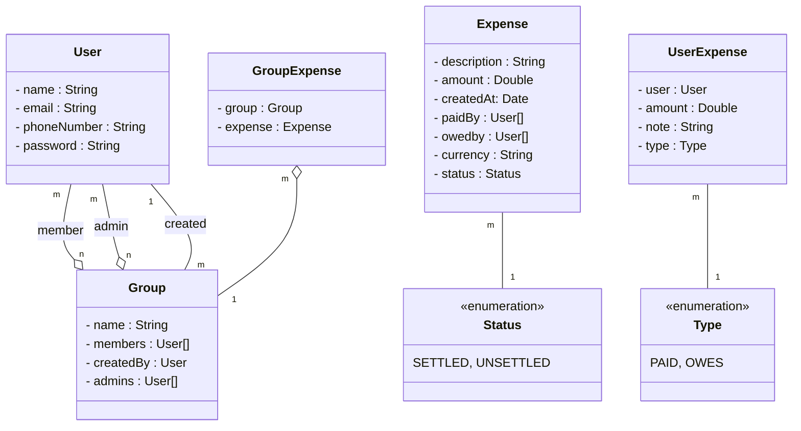
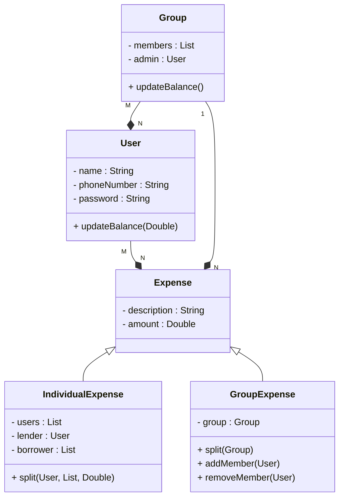

### Requirements

- `Users` can _**register and update**_ their profiles.
- A user's profile should contain at least their **name, phone number and password**
- Users can participate in `expenses` with other users
- Users can participate in `groups`.
- To _**add an expense**_, a user must specify either the **group**, or the other **users** involved in the expense, along with **who paid
  what** and **who owes what**. They must also specify a **description** for the expense.
- A user can _**see their total owed amount**_
- A user can _**see a history of the expenses**_ they're involved in
- A user can _**see a history of the expenses made in a group**_ that they're participating in
- Users shouldn't be able to query about groups they are not a member of
- Only the user who has created a group can _**add/remove members**_ to the group
- Users can _**request a settle-up**_. The application should show a list of transactions, which when executed will ensure that
  the user no longer owes or recieves money from any other user. Note that this need not settle-up any other users.
- Users can request a settle-up for any group they're participating in. The application should show a list of transactions,
  which if executed, will ensure that everyone participating in the group is settled up (owes a net of 0 Rs). Note that will
  only deal with the expenses made inside that group. Expenses outside the group need not be settled.
  Good to Have Requirements
- When settling a group, we should try to minimize the number of transactions that the group members should make to
  settle up.

```plantuml
left to right direction

Actor User
Actor Admin

rectangle Splitwise {
Admin - (Update members)

User - (Register)
User - (Add an expense)
User - (Create a group)
User - (Settle up)

(Group Expense) -> (Add an expense) : extends 
(Individual Expense) -> (Add an expense) : extends 
(Settle up) -> (Minimize transactions) : includes

}
```




