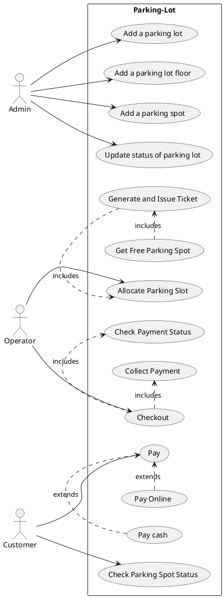

### Question on current scope:
1. How many floors?
2. How many gates?
3. How many slots per floor?
4. How is fees calculated?
5. What type of vehicles?
6. Are there different type of parking slots for the different type of vehicles?
7. Can a type of vehicle park in different type of parking slot?
8. What are payment methods?

### Questions on future scope:
1. Will floors be added in future?
2. Will parking slots be added in future?

### Requirements:
Build an online parking lot management system that can support the following requirements:

* Should have multiple **floors**.
* Multiple **entries and exit points**.
* A **person** has to collect a **ticket** at entry and _**pay**_ at or before exit.
* Pay at:
    * Exit counter (Cash to the **parking attendant**)
    * Dedicated automated booth on each floor - **Payment counter**
    * Online
* Pay via:
    * _Cash_
    * _Credit Card_
    * _UPI_
* Allow entry for a **vehicle** if a **slot** is _available_ for it. Show on the **display** at entry if a slot is not available.
* Parking Spots of 3 types:
    * _Large_
    * _Medium_
    * _Small_
* A car can only be parked at its slot. Not on any other (even larger).
* A display on each floor with the _status_ of that floor.
* _**Fees calculated**_ based on per hour price: e.g. 50 rs for the first hour, then 80 rs per extra hour. **invoice**
    * Small - 50, 80
    * Medium - 80, 100
    * Large - 100, 120

### Use case Diagram

```mermaid
classDiagram
    class ParkingLot {
        - name : String
        - address: String
        - floor : ParkingFloor[]
        - displayBoard : DisplayBoard
        - entryGates : Gates[]
        - exitGates : Gate[]
    }
    
    class ParkingFloor {
        - floorNumber : int
        - spots : Spot[]
        - displayBoard : DisplayBoard
        - paymentCounter : Counter
    }
    
    class ParkingSpot {
        - number : int
        - type : VehicleType
        - status : ParkingStatus
    }
    
    class DisplayBoard {
        - date : Date
        - spots : ParkingSpot[]
    }
    
    class PaymentCounter {
        - floor : int
    }
    
    class Gate {
        abstract
        - number : int
        - operator : Operator
    }
    
    class EntryGate {
        - display : DisplayBoard
    }
    
    class ExitGate {
        - paymentCounter : PaymentCounter
    } 
    
    class Vehicle {
       - number : String
       - type : VehicleType
    }
    
    class Ticket {
        - entryTime : Date
        - spot : ParkingSpot
        - vehicle - Vehicle
        - gate : Gate
        - user : User
    }
    
    class User {
        - name : String
        - email : String
        - phoneNum : String
    }
    
    class Invoice {
        - endTime : Date
        - ticket : Ticket
        - amount : Double
        - exitGate : Gate
        - payment : Payment[] //support partial payment
    }
    
    class Payment {
        - mode : PaymentMode
        - amount : Double
        - reference/transactionId : String
        - status : PaymentStatus
        - time : Date
    }
    
    class PaymentStatus {
        DONE, FAILED, PROCESSING
    }
    
    class PaymentMode {
        VASH, UPI, CRED
    }

    class VehicleType {
        SMALL, MEDIUM, LARGE
    }

    class ParkingStatus {
        FREE, OCCUPIED, OUT OF ORDER
    }
    
    ParkingLot "1" --* "m" ParkingFloor
    ParkingLot "1" --* "m" Gate
    ParkingLot "1" --* "1" DisplayBoard
    
    ParkingFloor "1" --* "m" ParkingSpot
    ParkingFloor "1" --* "1" DisplayBoard 
    
    Gate <|-- EntryGate
    Gate <|-- ExitGate
    ExitGate "1" --* "1" PaymentCounter
    
    Ticket "1" o-- "1" Invoice
    Ticket "1" --o "1" Vehicle
    Invoice "1" --* "m" Payment
````


