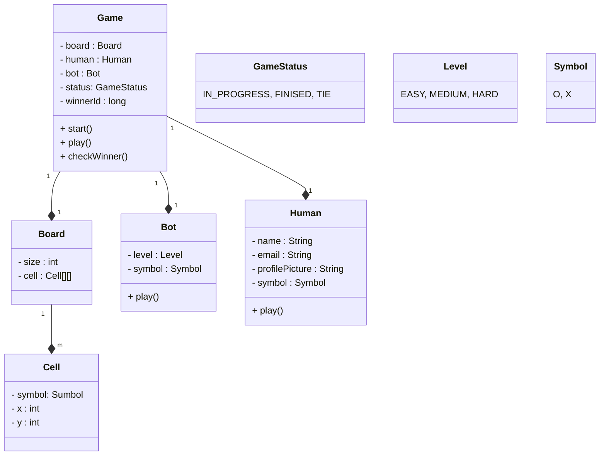
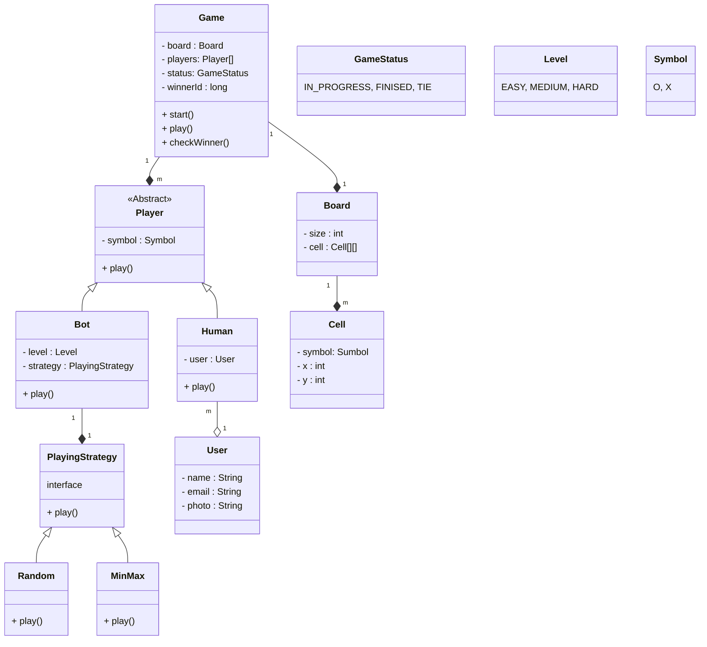

https://www.markdownguide.org/cheat-sheet/

https://mermaid.js.org/syntax/classDiagram.html

1. System is known or not known: Ask for overview
2. Requirement gathering : Asking questions (categorize the questions: current scope, future scope, behavior)

Think about structural components first:

## Current Scope
1. What is the size of board? (3 X 3)
2. How many players? (2)
3. Types of players? (Human or Bot)
4. Symbols? (O, X)

Look at the current scope and see if anything can change in future if yes, Ask questions for future scope:
Ask about dynamic values

## Future Scope
1. Future size of board (N X N)
2. Multiple players (level of difficulty)

Start from the very basic, start from flow of the system

## Behavior
1. Where will you start? - decide symbol
2. Who you should play with? Human or bot
3. If it is bot what us difficulty level?
4. Start the game - who should start the game? (random)
5. How do we play? (turn by turn)
6. Winning condition? (3 same symbols in row or col or diagonal)
7. If it is a tie how to decide? (If all spaces are filled anf no one won)

Do as less as possible and with proper implementation - don't suggest features (undo etc.)

Skipping use case diagram for this - but we need to have it

## Try to identify the entities
In the requirements find all the nouns and attributes and behaviors.

* **Board** can be of any NxN _size_.
* There can be two players.
* Each **player** will be allotted a **symbol**.
* The symbol can be one of _O_ and _X_.
* The players can be either _humans_ or _bots_.
* Each human player will have a _name_, _email_ and _profile_ _image_.
* Each bot player will have a _difficulty level._
* Any random player can _**start**_ the **game**.
* Then the players will **_take turns_** alternatively.
* The player with any consecutive N symbols in a row, column or diagonal **_wins_**.
* If the board is full and no player has won, the game is a **_draw_**.

### Problems with above approach:
1. We can't have 2 human players or more than 2 players - tight coupling between game and player
2. Field and method duplication - in human and bot
3. How to implement leve wise playing for bot - we will use if-else for level wise implementation (violets SRP and OCP)
4. Memory wastage - for same human we will create many objects - in case if one person plays multiple games at a time

### How to solve?
1. Use array of Players - 1 and 2 solved
2. Solve 3 by implementing 3 different classes by levels, but we will see redundant code. Instead, use strategy pattern. Create Strategy class/interface, don't name implementation classes on levels but on strategies. (Suppose easy and medium use random strategy then we will have code redundancy) 
3. Solve 4 by flyweight pattern - when we have memory wastage by redundant fields then use flyweight (intrinsic, extrinsic class). User class fields that do not change, Human will have fields that will change

## How to implement?
Use 3 layered architecture (MVC, MVT)
Controller - request/presentation layer

Service - business/logic layer

Repository - data layer - talks to database and gets the data and converts it to models (POJO)

What ia API?
* Remote procedure call
* To call a method on a remote system
* basically in client-server model (client: browser, app, postman)
* API is how client talks to server

Client sends request to server to get user with id 1 - 
* User controller will get the request, this is passed to service
* Service receives the request and sends this to data layer
* Repository will then fetch from database pass to service.
* Service will then perform authorization, validations etc

Models?
* A class has state (attribute) and behavior (methods)
* data models are Entity class - ex User {name,email, setters and getters}
